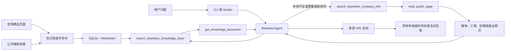

# Beambox 企业资料 AI Agent

一个面向深圳光胜人工智能科技有限公司及旗下 Beambox 品牌的工具调用 Agent。模型优先检索本地知识库并读取相关文档；当本地资料不足或问题强调时效性时，再检索公开网页，最终生成带来源链接的企业与品牌资料回答。核心工具调用循环基于 OpenAI 兼容接口实现，适用于通义千问 DashScope。

## 功能概览

- 本地知识库优先：使用 SQLite 保存正文、来源类型、主题、抓取时间和内容哈希。
- 官网定向采集：读取 `beambox.com.cn` 的产品、品牌、使用指南和真实更新页面。
- 联网补充：本地资料不足或问题涉及最新动态时，通过百度搜索并读取公开网页正文。
- 证据分级：区分品牌官网、媒体报道、企业信息平台、招聘平台、全文和搜索摘要。
- 来源约束：回答只能引用工具实际返回的 URL，拒绝模型自行拼接链接。
- 双界面：提供命令行对话和 Gradio 网页聊天，均支持工具调用；Gradio 使用真实流式输出。

仓库当前随附的知识库快照（2026-07-27）：

| 指标 | 数量 |
| --- | ---: |
| 文档总数 | 36 |
| 已读取全文 | 29 |
| 搜索摘要线索 | 7 |
| Beambox 官网全文 | 17 |
| 知识主题 | 9 |

> 本项目中的企业、产品、融资和市场信息来自公开资料，不构成投资、采购或法律建议。品牌官网属于企业自述，重要主张应与独立来源交叉验证。

## 快速开始

```powershell
git clone https://github.com/wzj1228516103/python-ai-learn.git
cd "python-ai-learn\beambox-agent"

python -m venv .venv
.\.venv\Scripts\Activate.ps1
python -m pip install -e .
Copy-Item .env.example .env
```

编辑 `.env`：

```dotenv
OPENAI_API_KEY=你的_DashScope_API_Key
OPENAI_BASE_URL=https://dashscope.aliyuncs.com/compatible-mode/v1
MODEL_NAME=qwen-plus
```

启动 Gradio：

```powershell
beambox-agent-web --port 7860 --inbrowser
```

浏览器访问 [http://127.0.0.1:7860](http://127.0.0.1:7860)。首次使用前可以运行 `beambox-kb stats` 检查随仓库提供的知识库。

## 项目结构

```text
beambox-agent/
├─ .env.example
├─ data/
│  ├─ beambox_knowledge.sqlite3
│  ├─ beambox_knowledge.md
│  └─ README.md
├─ pyproject.toml
├─ README.md
├─ src/beambox_agent/
│  ├─ config/
│  │  ├─ agents.yaml
│  │  ├─ tasks.yaml
│  │  └─ knowledge_topics.yaml
│  ├─ tools/
│  │  └─ beambox_tool.py
│  ├─ config.py
│  ├─ crew.py
│  ├─ execution_logger.py
│  ├─ knowledge_base.py
│  ├─ main.py
│  └─ web.py
└─ tests/
   ├─ test_beambox_tool.py
   ├─ test_knowledge_base.py
   ├─ test_main.py
   └─ test_web.py
```

### 各结构的作用

| 路径 | 作用 | 通常什么时候修改 |
| --- | --- | --- |
| `.env` / `.env.example` | 保存 API Key、模型名、超时和工具轮数；`.env` 不提交 Git | 更换模型、密钥或运行参数时 |
| `pyproject.toml` | 定义项目名称、Python 版本、依赖库、安装方式和命令行入口 | 增删依赖或新增启动命令时 |
| `src/beambox_agent/__init__.py` | 包的公开入口，使外部代码能直接导入 `BeamboxAgent` | 需要公开新的稳定 API 时 |
| `config.py` | 加载 `.env`，构建不可变 `Settings`，读取 YAML | 新增环境变量或配置文件时 |
| `config/agents.yaml` | Agent 人设、目标和领域边界 | 调整“它是谁、关注哪个 Beambox”时 |
| `config/tasks.yaml` | 每次问答的执行步骤和答案标准 | 调整查询范围、工具要求或输出格式时 |
| `tools/beambox_tool.py` | 百度搜索、网页正文提取、URL 安全校验和工具注册 | 新增资料源或工具时 |
| `knowledge_base.py` | 采集公开资料、SQLite 存储、本地加权检索和 Markdown 导出 | 更新知识库结构或检索算法时 |
| `config/knowledge_topics.yaml` | 定义企业、产品、融资、团队等采集主题 | 增删知识领域或调整搜索词时 |
| `data/beambox_knowledge.sqlite3` | Agent 实际查询的结构化知识库，同一网页可归入多个主题 | 由 `beambox-kb build` 自动维护 |
| `data/beambox_knowledge.md` | 按主题导出的可读版资料目录，便于人工审阅来源与正文 | 构建或执行 `beambox-kb export` 后更新 |
| `crew.py` | 核心编排：消息历史、强制工具流程、来源记录、同步/流式回答 | 修改 Agent 决策流程时 |
| `execution_logger.py` | 把工具调用写入可轮转日志 | 修改日志格式和保留策略时 |
| `main.py` | 命令行入口，支持单次问题和连续对话 | 修改 CLI 参数或终端体验时 |
| `web.py` | Gradio 页面、历史上下文、流式气泡和 Web 服务 | 修改网页 UI 或并发设置时 |
| `tests/` | 使用模拟 HTTP/模型对象验证逻辑，不消耗模型额度 | 每次修改核心逻辑时同步更新 |
| `logs/` | 运行时生成的工具调用日志 | 排查搜索、页面读取或模型调用问题时查看 |

## 依赖库说明

| 库 | 在本项目中的用途 |
| --- | --- |
| `openai` | 使用统一的 Chat Completions、function calling 和 stream 接口调用 DashScope |
| `requests` | 访问百度搜索页面、跟随跳转并读取公开来源网页 |
| `beautifulsoup4` | 按 HTML 结构提取搜索结果，清除脚本/样式并生成纯文本正文 |
| `gradio` | 创建网页聊天界面、请求队列、示例问题和流式输出 |
| `python-dotenv` | 从 `.env` 加载密钥，不把凭据硬编码进 Python 文件 |
| `PyYAML` | 把 `agents.yaml` 和 `tasks.yaml` 转换为提示词字典 |
| `setuptools` | 安装 `src` 布局项目并生成 `beambox-agent`、`beambox-agent-web`、`beambox-kb` 命令 |
| Python `json` | 在模型工具调用与 Python 方法之间传递结构化参数和结果 |
| Python `ipaddress` | 识别本机、私网和保留 IP，避免网页工具访问内部地址 |
| Python `logging` | 记录工具调用与参数，并通过轮转限制日志占用空间 |

## 核心调用链



调用过程中的关键状态：

- `_messages`：完整保存 `system`、`user`、`assistant`、`tool` 消息，是模型理解上下文的依据。
- `searched_this_turn`：保证每个新问题至少查询一次本地知识库，不能直接使用模型记忆。
- `_required_document_ids`：保存本地检索命中的文档 ID；未读取相关知识文档前禁止生成最终答案。
- `_required_source_urls`：联网搜索后保存候选页面；未读取相应网页前禁止使用它作为正文证据。
- `_known_urls`：记录工具真实返回过的地址；答案引用不在其中就会被拒绝。
- `max_tool_rounds`：限制模型和工具的往返次数，避免死循环和不可控费用。

`ask()` 与 `ask_stream()` 的区别：

- `ask()` 等完整答案生成后返回，能在输出前完成 URL 校验，适合 CLI 和自动化脚本。
- `ask_stream()` 使用 `stream=True` 接收模型增量片段，Gradio 会不断刷新聊天气泡。
- 流式 function calling 的函数名和 JSON 参数可能被拆成多个片段，因此 `crew.py` 会按 `tool_call.index` 重新拼装后再执行。

## 配置字段说明

`agents.yaml`：

- `role`：模型扮演的身份。
- `goal`：长期目标，例如只研究深圳光胜人工智能科技旗下 Beambox。
- `backstory`：领域背景和排除项，用来避免搜到 FLUX 等同名品牌。

`tasks.yaml`：

- `description`：每次问题需要完成的工作和必须调用的工具。
- `expected_output`：答案语言、引用格式、来源标注及资料不足时的行为。

`.env`：

- `OPENAI_API_KEY`：DashScope 或兼容服务密钥。
- `OPENAI_BASE_URL`：OpenAI 兼容接口地址。
- `MODEL_NAME`：支持 function calling 和流式输出的模型。
- `REQUEST_TIMEOUT_SECONDS`：搜索和读取网页的 HTTP 超时秒数。
- `MAX_TOOL_ROUNDS`：一次回答允许的最大工具往返轮数。

## 工作方式

1. `search_beambox_knowledge_base` 优先搜索本地 SQLite 知识库。
2. `get_knowledge_document` 读取最相关文档及来源元数据。
3. 本地没有结果或问题强调最新信息时，`search_beambox_company_info` 联网搜索。
4. `read_public_page` 跟随搜索结果链接并提取网页正文。
5. 模型区分来源性质，根据已读取内容回答并附上真实来源链接。

代码层强制每轮先查询本地知识库，再读取至少一个命中的本地知识文档；只有本地无结果或需要补充最新信息时才要求联网。最终答案中的 Markdown URL 必须来自工具结果。网页读取会拒绝本机、内网和保留地址。

## 知识库维护

构建或增量更新全部主题：

```powershell
beambox-kb build
```

抓取 `beambox.com.cn` 精选官网页面（产品、品牌说明、指南和真实更新）：

```powershell
beambox-kb crawl-official
```

该命令只发起网页请求，不调用大模型，也不消耗模型额度。

官网站点地图包含数千篇高度相似的模板化文章。该命令只采集默认英文规范 URL
中的核心页面，跳过多语言镜像、法律/账户页面和批量 SEO 内容，避免稀释知识质量。

查看覆盖情况：

```powershell
beambox-kb stats
```

不调用模型，直接检索本地资料：

```powershell
beambox-kb search "融资和资金用途"
```

知识库存放在 `data/beambox_knowledge.sqlite3`，可读目录导出到
`data/beambox_knowledge.md`。数据库使用 `(URL, 主题)` 作为唯一组合，因此同一来源可以归入多个知识主题；重复构建会更新已有记录，不会在同一主题下重复插入。

知识条目的证据等级：

- `full_text`：已成功读取公开网页正文，可作为主要证据。
- `search_snippet`：只保存搜索结果摘要，用来发现线索，回答时应降低权重并尽量补读原文。
- `品牌官网（企业自述）`：第一方资料，适合确认产品功能和品牌定位；营销性、获奖和市场地位主张仍需第三方来源交叉验证。

## 运行

交互模式：

```powershell
beambox-agent --verbose
```

单次查询：

```powershell
beambox-agent --verbose "Beambox 的品牌定位和主要产品是什么？"
```

不安装命令行入口时也可运行：

```powershell
python -m beambox_agent.main "深圳光胜人工智能科技有哪些融资动态？"
```

### Gradio 网页界面

```powershell
beambox-agent-web --inbrowser
```

默认从 `http://127.0.0.1:7860` 开始选择可用端口；如果 `7860` 已占用，Gradio 会自动使用后续端口。也可以手动指定：

```powershell
beambox-agent-web --port 7861
```

只应在可信网络中使用 `--host 0.0.0.0`。如需 Gradio 临时公网链接，可增加 `--share`。

网页回答使用真实的模型流式接口：资料工具调用完成后，Qwen 返回的增量内容会持续更新到聊天气泡中。

`--verbose` 只在终端显示工具名和参数，不打印 API Key。运行日志写入当前目录的 `logs/execution.log`。

## 常见问题

### 直接运行 Python 文件时报相对导入错误

推荐使用安装后的命令或模块方式：

```powershell
beambox-agent-web --port 7860
python -m beambox_agent.web --port 7860
```

不要优先使用 `python src/beambox_agent/web.py`。虽然项目保留了直接运行兼容逻辑，但模块方式更符合 `src` 布局的包加载规则。

### 7860 端口已被占用

指定其他端口即可：

```powershell
beambox-agent-web --port 7861
```

### 提示没有 API Key

确认当前目录或其父目录存在 `.env`，并且设置了 `OPENAI_API_KEY` 或 `DASHSCOPE_API_KEY`。不要把真实 `.env` 提交到 Git。

### 只想查询知识库，不调用模型

直接使用：

```powershell
beambox-kb search "Nikko 的屏幕、二维码和佩戴方式"
```

## 测试

```powershell
python -m unittest discover -s tests -v
```

测试使用模拟 HTTP 响应，不消耗模型额度。若要验证公开资料搜索，可运行：

```powershell
python -c "from beambox_agent.tools import BeamboxCompanyTool; print(BeamboxCompanyTool().search('融资动态', limit=3))"
```

## 扩展工具

新增工具时，在 `src/beambox_agent/tools/` 中实现方法，并在 `TOOL_DEFINITIONS` 和 `ToolRegistry.execute()` 注册。工具返回值应为可 JSON 序列化对象；读取外部 URL 时必须继续阻止本机、内网和保留地址。
